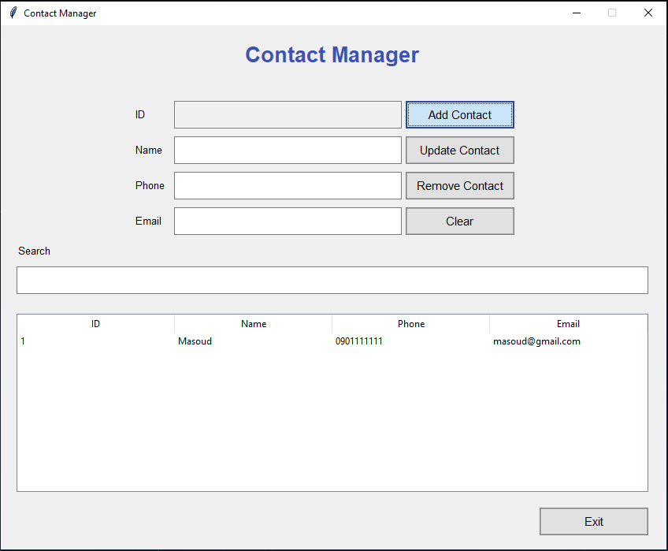

``# Contacts Manager

A contacts manager application built with Python and Tkinter.

## Screenshots

## Technologies Used:

- Python
- Tkinter
- SQLite3
- Object-Oriented Programming (OOP)

## Features:

- Add a contact
- Update a contact
- Remove a contact
- Display all contacts
- Live search for contacts

## How to use

- Clone the project
- Install Python (v3.11.5)
- Run `pip install -r requirements.txt` to install necessary dependencies.

## Run app

In the project directory, you can run:

`python main.py`
``
