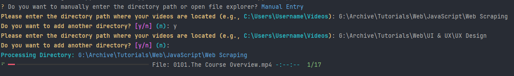
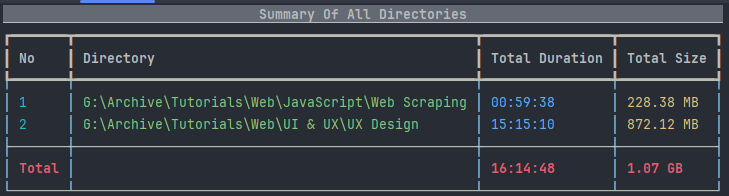
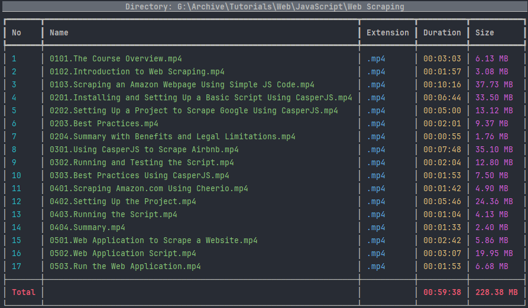
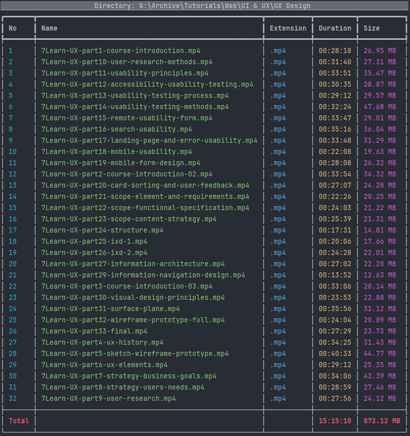

# Video Duration Calculator

A simple Python script to calculate and summarize the durations of video files in specified directories. The script supports multiple video formats and provides the total duration
in a readable output.

## Screenshots






## Technologies Used

- Python
- moviepy library for video processing
- Rich library for enhanced terminal output
- InquirerPy for interactive prompts
- Tkinter for file dialog

## Features

- Scan user-specified directories for video files.
- Supports multiple video formats such as .mp4, .avi, .mov, etc.
- Calculates the duration and size of each video file.
- Sums up the total duration and size of all videos.
- Outputs the details and total duration in a structured format.

## How to Use

1. Clone the project.
2. Install Python (v3.x recommended).
3. Run `pip install -r requirements.txt` to install necessary dependencies.

## Running the Script

In the project directory, where the script is located, run:

```shell
python main.py
```

The script will prompt you to either manually enter directory paths or use a file explorer to select directories. It will then process the video files in the selected directories
and display the results in the terminal.
